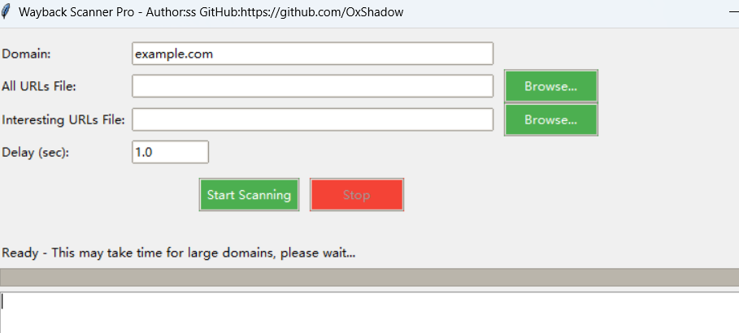

# waybackscanner
This project uses the wayback machine API interface to collect some information that existed on the website in the past and filter out URLs that are prone to problems, increasing the utilization of information collection.

This program is very easy to use, using UI design, only need
***python wayback.py***

